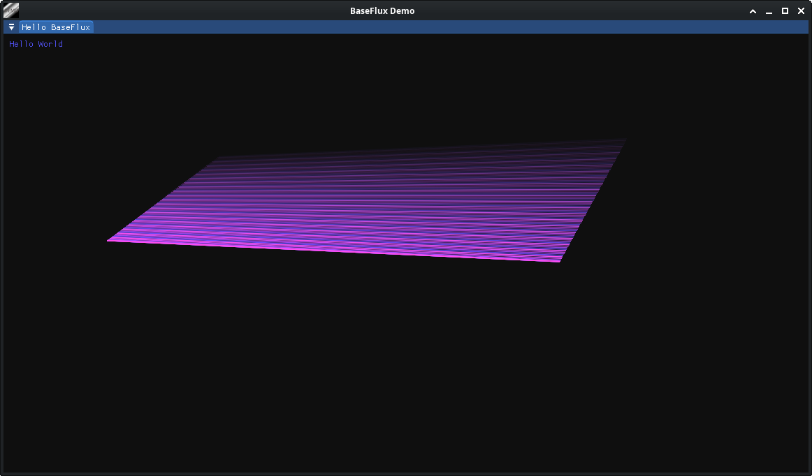

# BaseFlux - Minimalist SDL3 and ImGui base

Base to build an cross platform Application or Prototype with SDL3 and ImGui. 

## Prepare Example
- create a new folder with a sub folder src
- copy CMakeLists.txt from demo to you new folder
- create a new empty main.cpp in src 

## CMake in Projects
- demo: cmake example with setting a path to BaseFlux
- demo2: cmake with fetch content BaseFlux


## Implement

Only five steps to get it work:

- set your custom settings like Caption, Company .. 
- InitSDL
- InitImGui 
- Setup Render and optional other Event Callbacks 
- Execute 

``` 
//-----------------------------------------------------------------------------
// BaseFlux Demo main.cpp
//-----------------------------------------------------------------------------
#include <SDL3/SDL.h>
#include <SDL3/SDL_main.h>
#include "imgui.h"
#include "BaseFlux/Main.h"

int main(int argc, char* argv[]) {
    BaseFlux::Main app;
    app.getSettings() = {
        .Caption = "My App"
    };
    if ( !app.InitSDL() ) return 1;
    app.initImGui();
    app.OnRender = [&](SDL_Renderer* renderer) {
        if (ImGui::Begin("Hello World"))
        {
            if (ImGui::Button("Close")) app.TerminateApplication();
        }
        ImGui::End();
    };
    app.Execute();
    return 0;
}
```


## Demo with cmake build system:

Compile and run : 
```
cd demo
cmake -S . -B build
cmake --build build
./BaseFluxDemo
```




